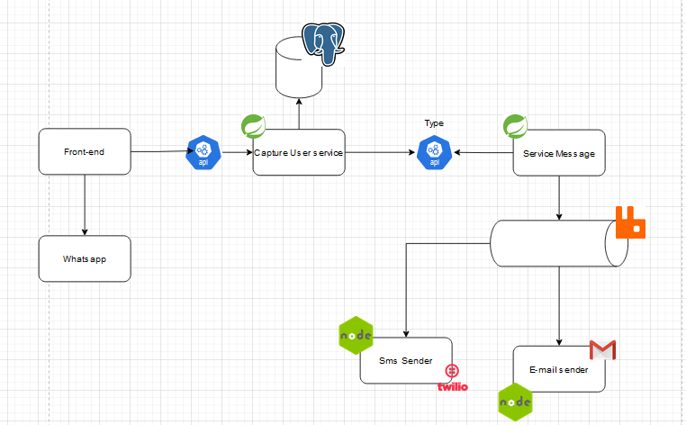
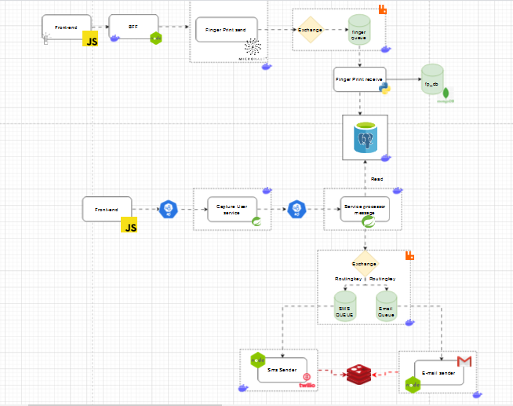

## Customer capture system

#### The project aims to create what would be a Lead registration system for a capture page, using the Node.js and Java Spring boot programming languages.

Technologies used:

- Java 21
- Log4j
- RabbitMq
- PostgreSQL
- Docker
- Microsservices
- Node.js
- Express
- Twillio
- SMTP
- Go lang
- Micronaut

Below we have the first idea of the project:

 

Below we have an image of how the project is looking

We have a capture system that is a BFF (back for front-end), where it sends data to the messaging system via Feing Client. The messaging system saves the data in the database and sends information to 2 queues, the SMS queue and the email queue. Where they will be consumed by services in Node.js.

 
